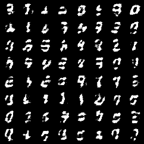
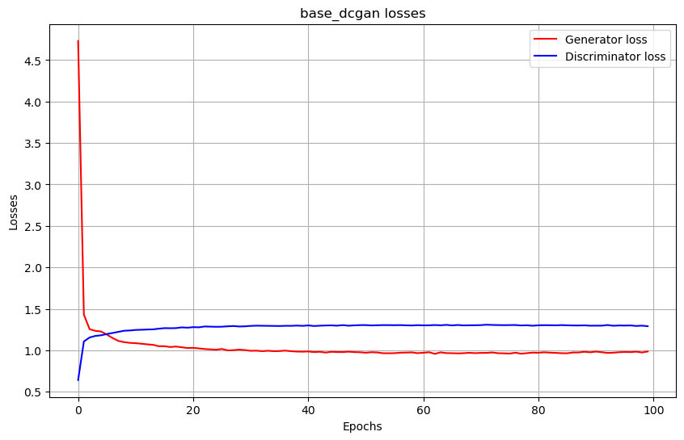
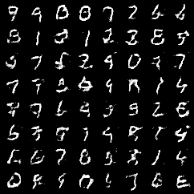
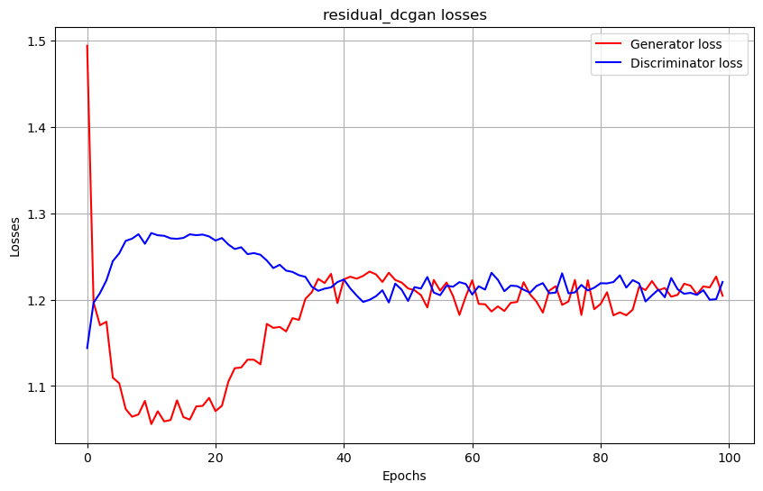
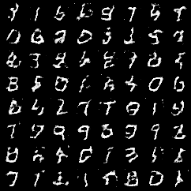
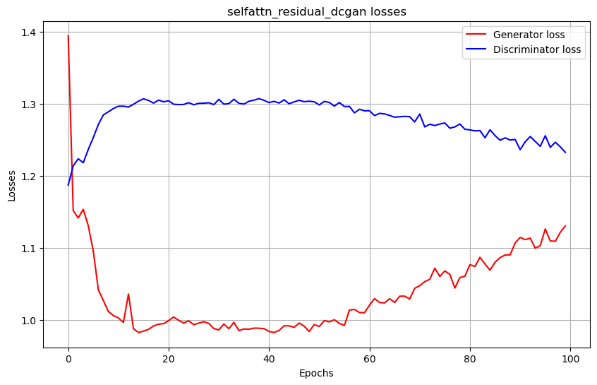

# Курсовой проект: Mini-GAN и влияние архитектуры

## Цель
Исследовать связь архитектуры генератора с устойчивостью обучения Generative Adversarial Networks (GAN) на примере датасета MNIST.

## Описание
Реализация трёх вариантов GAN для генерации изображений цифр MNIST (28×28 пикселей):
1. **Базовый GAN** – стандартные сверточные слои
2. **GAN с residual-блоками** – добавление skip-соединений в генератор
3. **GAN с self-attention** – включение механизма внимания в архитектуру генератора

## Результаты обучения
### DC-GAN:
#### Генерации по эпохам

#### График потерь


### residual DC-GAN:
#### Генерации по эпохам

#### График потерь


### residual DC-GAN (self-attention в генераторе):
#### Генерации по эпохам

#### График потерь



## Установка и запуск

### 1. Настройка окружения
```bash
# Создание виртуального окружения conda
conda env create -f environment.yaml

# Активация окружения
conda activate mini-GAN
```

### 2. Запуск Jupyterlab 
```bash
jupyterlab .
```

### Информация о коде

Базовый dc-dcgan:
- base_dcgan.ipynb - обучение 
- base_dcgan_show.ipynb - результат обучения (генерация для оценки)

dc-gan c добавлением остаточных блоков:
- residual_dcgan.ipynb - обучение 
- residual_dcgan_show.ipynb - результат обучения (генерация для оценки)

dc-gan c добавлением остаточных блоков и слоя самовнимания в генераторе:
- selfattn_residual_dcgan.ipynb - обучение 
- selfattn_residual_dcgan_show.ipynb - результат обучения (генерация для оценки)

Результаты обучения сохраняются в директории `result`, также как и веса окончатьльных модели (генератора/дискриминатора)

